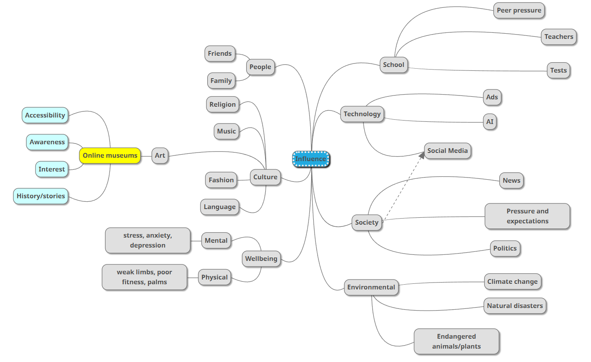
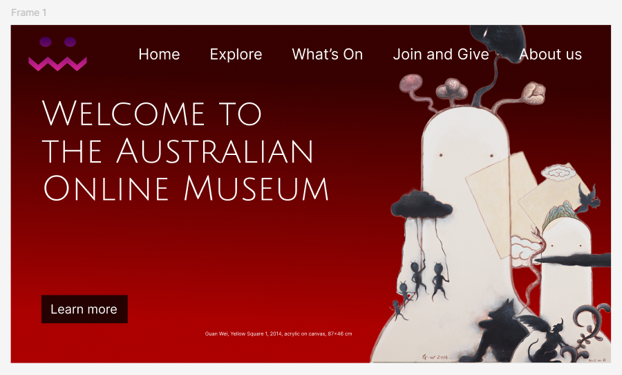
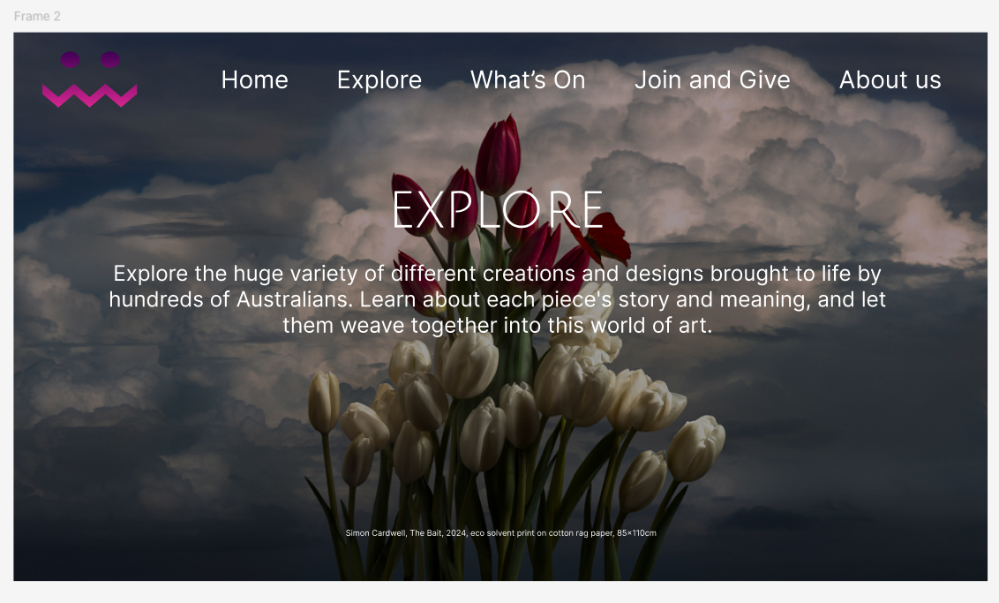
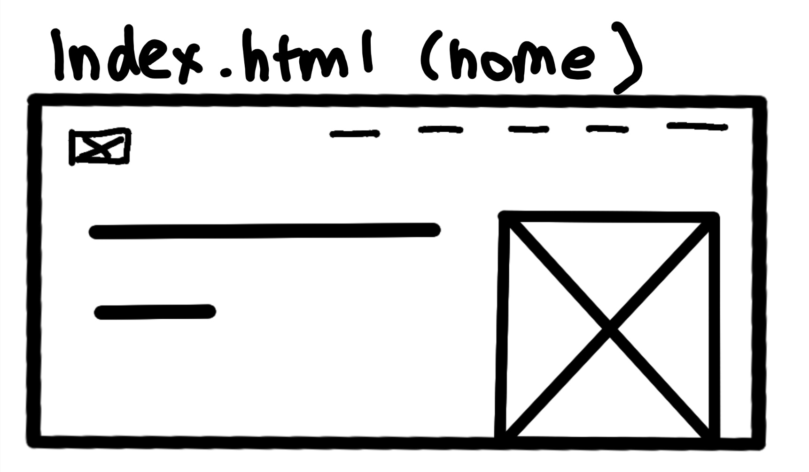
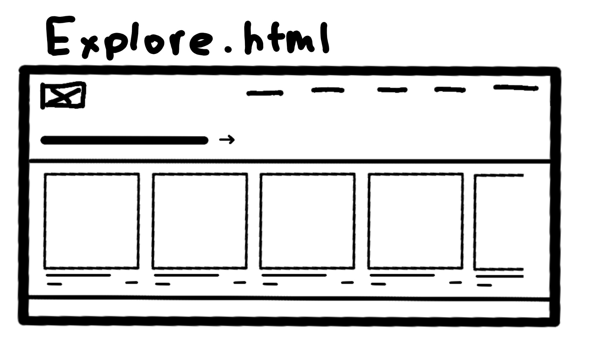
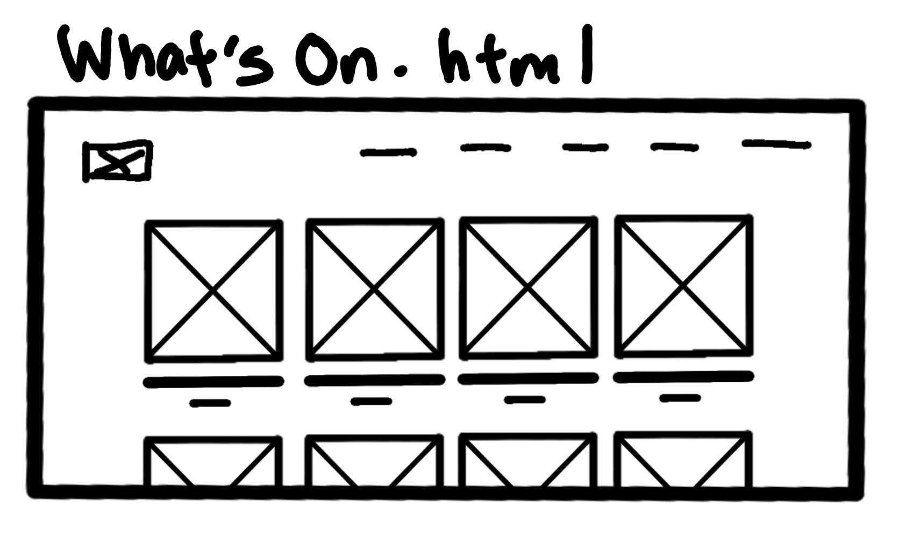
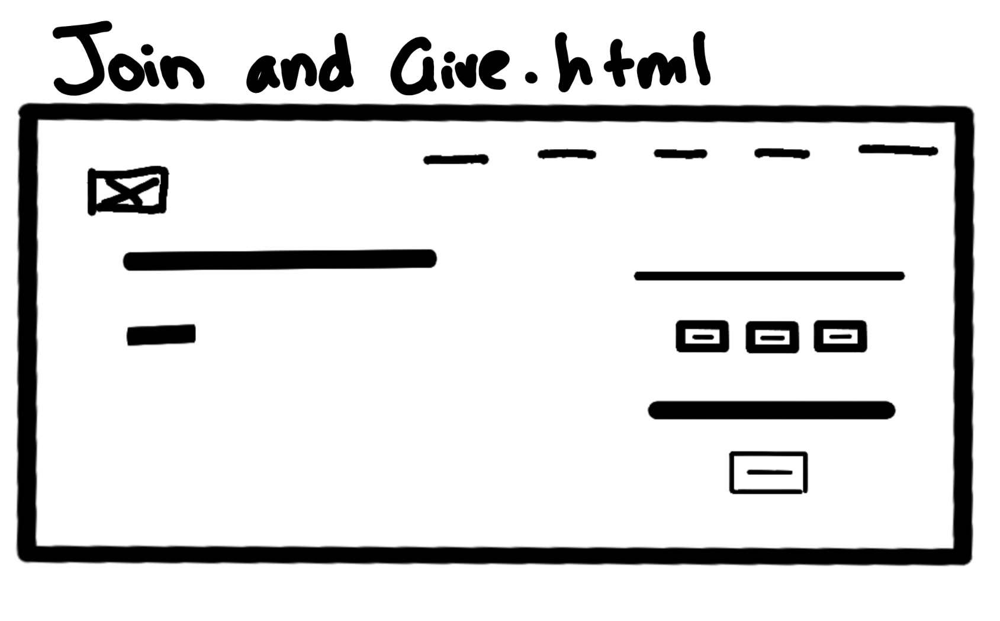
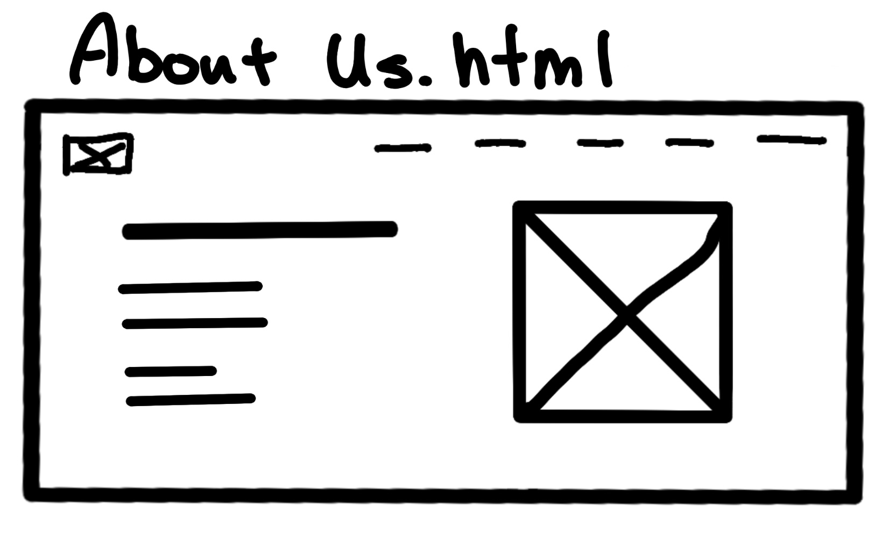

 

# **10CT Assessment Task 2**
**By Vivian Ding**

---

## **Identifying and Defining**
### *Divergent Thinking*

### *Convergent Thinking*

| Idea | Effort | Impact | Notes |
|------|--------|--------|-------|
| Home | Low | High | Immersive introduction, good impression |
| Explore | High | High | Majority of information, categories |
| What's On | High | High | Interesting, cool, engages people into learning new topics |
| Join and Give | Low | Low | Museum's have memberships and donations soooo |
| About Us | Low | Medium | Contact page for authenticity? Idk feels real |
| Online Events Calendar | High | Medium | Let people search events online to visit physical events |

 

__SWOT ANALYSIS__  
 
Home page:  
* S: Shows highlighted content, first impression of the website
* W: Little information on the page, more directs it to other categories
* O: Can show top artists, exhibitions and promotions
* T: Users may leave quickly if too confusing/basic

Explore page:  
* S: Allows users to browse the collections, see topics they may be interested in
* W: Complex to organise, lots of content
* O: Encourages deeper engagement, promotes new artists and creations
* T: Users may get overwhelmed or lost without clear navigation

What's On page:  
* S: Keep users updated, engagement
* W: Regular updates
* O: Promotes new exhibitions and features a specific section of art and information
* T: Outdated/Not-updated-regularly-enough info can frustrate users, interest and engagement various based on topic

Join and Give:  
* S: Supports the museum with memberships and donations
* W: Some users may be reluctant to register or donate
* O: Increases funding and community involvement
* T: Security and privacy concerns, users may expect more rewards/offers

About Us:  
* S: Trust and official legitimacy, allows users to contact
* W: Not very engaging at all, not needed very often
* O: Promote socials to attract more users and showcase more information
* T: Users do not need to use this function and therefore takes up space in the navigation bar

Online Events Calendar:  
* S: Easy to see upcoming events, opportunity to promote informative and engaging topics
* W: Very frequent updating, need to be in contact with event organisers and provide exact details
* O: Reminds, bookings
* T: Outdated info or technical issues can frustrate users

### *Requirements Outline*

Functional Requirements  
* The website should be able to clearly navigate between different sections of the website
* The website should be able to view through collections and artworks
* The website should be able to provide information about the exhibitions
be able provide ways to contact the museum

Non-Functional Requirements
* The website should be able to accessible to users with disabilities
* The website should be able to load quickly and efficiently
* The website should be able to work on all major browsers
* The website should be able to handle a large amount of visitors without performance issues
* The website's content and design should be able to be updated by museum staff

 

## **Researching and Planning**
### *Explore Existing Ideas*

| App | Plus | Minus | Implications |
|-----|------|-------|--------------|
| Australian Museum | The layout and design are very clean and easy to read, with clear sections and categories for the different exhibitions. There is a very large range of topics that can be browsed, and each screen is well informed and neat. | I dislike the very large drop down menus after clicking on the headers, as it suddenly takes up all the screen space and is quite overwhelming. | I am going to make similar layout to the website, but reduced information crowding, as well as a simpler colour palette. |
| Smithsonian National Museum of Natural History | I find the colour palette and navigation to be enjoyable and calming. I find the layout of images and information especially well designed and clean, conveying all the important points. | There are many pop ups on the side of the screen that are a little annoying as they sometimes covers parts of the information. | I am going to include the layout and readability of the website, the simple yet effective navigation bar and the specific placement of images for the most readability. |
| Melbourne Museum | I find that websites with large images and fonts much easier to navigate and makes the browsing experience much more enjoyable. The website is extremely informative with clear sections and categories, and the black, blue and white background is pleasant to look at.| I don't have much to critique, but I do find how the repetitive layout for majority of the screens is a bit overwhelming, as it makes it more tiresome to specifically look for something over identical layouts. | I'll be ensure to clearly categorise the sections with images and text that ensure readability. |

 

### *Secondary Research*

Multiple studies show that online museums significantly increase accessibility, engagement and interest of culture, heritage, and history. By including immersive, informative and freely-available, they can deepen learners understanding, strengthen their connection and even influence their willingness to visit physical sites. By making these collections accessible anywhere, it can improve people's mood as they can learn and view things whenever they want.

Sources:

__Empowering Learners through the Integration of Museum Experiences and Digital Technologies__
https://www.berghahnjournals.com/view/journals/museum-worlds/11/1/armw110115.xml

__Digital Engagement and Wellbeing: The Impact of Museum Digital Resources on User Wellbeing During COVID-19__
https://www.tandfonline.com/doi/pdf/10.1080/2159032X.2023.2228173

 

### *Primary Research*

__Quantitative: 1-5 (1 is low, 5 is high)__

Q1. How often do you visit museums in person?  
Q2. Would you use an online museum website to explore exhibitions?  

__(1 is not important, 5 is important)__  
Q3. How important is ease of navigation in a museum website?  
Q4. How important is visual design and images in a museum website?  

__Results:__

Q1. Average: 1.4  
Q2. Average: 4.3  
Q3. Average: 3.8  
Q4. Average: 3.1

After reading these results, it is clear that an online museum would be helpful and useful, as people can then browse and learn about specific topics freely and accessible from anywhere. Time, travel and other conditions can all affect going to a physical museum, so having one online is very convenient for interests and information. It seems that other people take clear navigation just as important as I do (:D), so I will ensure that the navigation is easy and simple to use. Visual design is understandably not that important to other people, as it may affect readability and layout.

### *UI / UX Design*

Website wireframe and webpage storyboards

### *Prototype*

Home page + another on figma or Adobe XD
[insert images and link]

https://www.figma.com/proto/HR7t79rV7W1uwFeqmRRYsK/10CT-Assessment_Task-2-Prototype?node-id=33-21&t=QTADvRPD3mxQA2uR-1

## **Producing and Implementing**

### *Development*

I made my assessment task in html thank you :D

### *Documentation*

"Document the whole development process (including all of the above) in a Markdown (.md) file."   
yessir

### *Version Control*

oh

## **Testing and Evaluation**

### *Peer Evaluation*

Evaluate your project and your peers.

Person 1- Shieun Park
The website works well and effectively categories information well. The colours, fonts and text size are consistent and readable, and all aesthetically pleasing, while the navigation is clear and simple. It effectively completes the requirements of the assessment task and it a well-made project. For future improvements, I would recommend improving the "Explore" section, as the different sections are quite overwhelming and hard to look at, especially with the scroll bars and white background. However, this website was made with clear consideration of the requirements as well as taking in the information learnt from the surveys.

Person 2- Li-shin Goddard  
This website completes the tasks of the assessment as it increased my interests of Australian art, and therefore influenced my perspective of art by a lot. Even though there was limited information of the What's On page, I was actually pretty engaged with Rock formation art, which is a topic I've never heard before. Also, giving recognition to Australian artists is really beneficial to them and to learners', as it lets them express their ideals and stories with passion. For some improvements, I would hope it can be optimised to be viewed on different devices more maximum accessibility. I know this project was a but rushed and limited with functions, but I think planning a bit further ahead before starting the code would be cool, as I am someone who accesses majority of websites on my phone.

### *Evaluation of Issues*

The website, as an online museum, has the responsibility to let all cultural and historical knowledge accessible to a broad and diverse audience, as it is information that should be shared with anyone. Children, students, researchers, and the general public should be able to browse and view content that is engaging, age-appropriate and understandable. This promotes inclusivity and a large sense of community between people, education and arts.

Ethically, the museum should be aware and respectful of any cultural insensitiveness, where all the information is accurate, credited and analysed correctly. Any misrepresented, misused or plagiarism of any artists and creations are strictly prohibited. Furthermore, for functions such as memberships and donations that require information such as emails and bank information, all data is secured and only stored if necessary.

The website ensures that all property rights of artworks, texts, media can only be used with permission, with, most importantly, the artists' privacies are protected securely. Furthermore, the entire website and organisation must comply with all privacy laws and security standards.

### *Project Evaluation*

I am satisfied with the final product in regard to fulfilling the requirements needed for the task. There are many MANY things I would like to further work on and improve on, but considering what I have completed I am content. My time management was...well not great at all (finished everything in 2 days haha i have no sleep wooooo its 5am), and I know that most definitely affected my final product. Considering the time I decided to leave myself with, I feel like the website is acceptable. Considering the time we had the whole time... yeah it's not great but that's my life (as a fool lmao). Regarding the target market, I feel like it would increase the engagement and appreciation of Australian art and their artists. It provides easy access to collections online, allowing people all over the world to learn and explore artworks with fascinating stories behind them. I actually learnt so much about different artworks and their meanings while making this project, and (believe it or not) I thoroughly enjoyed making the website very much. It was a little difficult and confusing, but I now have a much larger interest in art styles and their artists, for their creativity is half the beauty of their designs. I was certainly influenced greatly by this website, and that's why I believe it fulfills the requirements of the task by positively influencing the target market by spreading the accessibility of art and community.